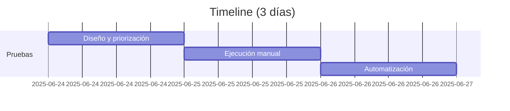

# Test Plan - Sistema de Registro y Login

- [1. Alcance](#1-alcance)
  - [Pantallas cubiertas](#pantallas-cubiertas)
  - [Funcionalidades a probar](#funcionalidades-a-probar)
  - [Tipos de prueba](#tipos-de-prueba)
- [2. Estrategia](#2-estrategia)
- [3. Riesgos Principales (Actualizado)](#3-riesgos-principales-actualizado)
- [4. Recursos](#4-recursos)
- [5. Cronograma](#5-cronograma)

## 1. Alcance
### Pantallas cubiertas:
- **Login**: 
  - Campos: Username, Password
  - Botones: Login, Register
- **Register**: 
  - Campos: First Name, Last Name, Username, Password
  - Botones: Register, Cancel
- **Sesión Iniciada**: 
  - Campos: Tabla de Usuarios
  - Botones: Logout, Delete

### Funcionalidades a probar:
- Registro de nuevos usuarios
- Autenticación de usuarios existentes
- Validación de campos de formulario
- Gestión de sesiones
- Eliminación de cuentas
- Protección contra amenazas básicas (XSS, SQLi)

### Tipos de prueba:
- Funcionalidad básica (registro, login, borrado)
- Validaciones de formularios frontend
- Casos de error y mensajes al usuario
- Flujo completo (registro → login → borrado)
- Pruebas de seguridad básica

## 2. Estrategia
| Tipo          | Enfoque                          | Herramientas               | Cobertura                           |
|---------------|----------------------------------|----------------------------|-------------------------------------|
| Manual        | Casos de uso principales         | Checklist exploratorio     | 100% de casos básicos              |
| Automatizado  | Flujos críticos y repetitivos    | Playwright (TS)    | Registro, login, borrado           |
| Seguridad     | Validaciones básicas             | Pruebas manuales           | XSS, SQLi, gestión de sesiones     |
| Usabilidad    | Feedback al usuario              | Observación directa        | Mensajes de error, validaciones    |

## 3. Riesgos Principales
| Riesgo                          | Mitigación                          | Prioridad | Estado       |
|---------------------------------|------------------------------------|-----------|--------------|
| Datos no validados              | Pruebas exhaustivas de input       | Alta      | Parcialmente mitigado |
| Gestión insegura de sesiones    | Validar timeout e invalidación     | Alta      | No mitigado  |
| Exposición de datos sensibles   | Restringir acceso a lista usuarios | Alta      | No mitigado  |
| Contraseñas débiles permitidas  | Implementar política de complejidad| Media     | No mitigado  |
| Persistencia de sesión post-borrado| Invalidar sesión al eliminar cuenta | Alta      | No mitigado  |

## 4. Recursos
- **Entorno**: 
  - Navegador: Chrome (última versión)
- **Herramientas**: 
  - Automatización: Playwright con TypeScript
  - Reportes: Allure o HTML Reporter
- **Datos de prueba**: 
  - Combinaciones válidas/inválidas para campos
  - Datos para pruebas de seguridad (XSS, SQLi payloads)
  - Usuarios pre-registrados para pruebas

## 5. Cronograma
